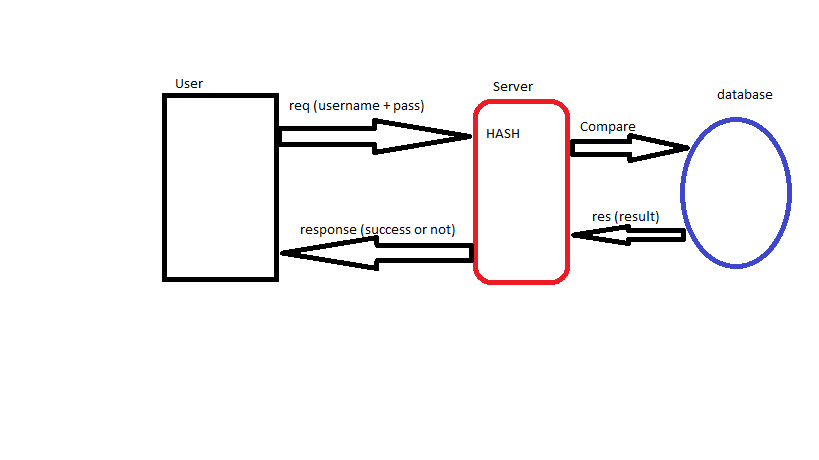

# auth-server

### Topic: Auth Server

### Author: Obada Tumah

## Setup

### How to initialize/run your application (where applicable) e.g. nodemon OR npm run 

### URL Example : get(http http://localhost:3030/users/).set({Authorization: username:password})

## Tests

### Tested on swagger inspector

[swagger](https://app.swaggerhub.com/apis/Tumaho/class13/0.1)

## UML

